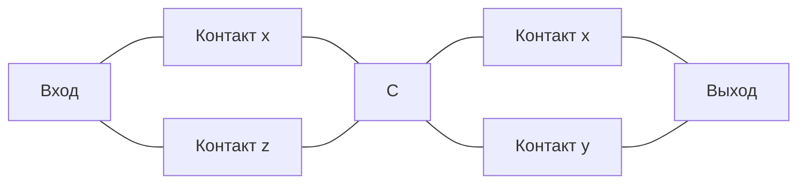
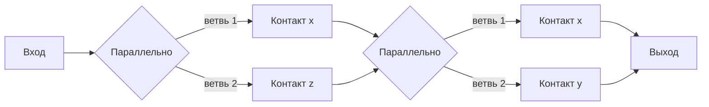
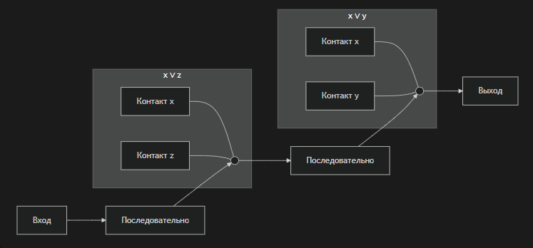

# Логические задания (Вариант 1)

## Задание 1
Постройте таблицу значений для заданной булевой функции:

**f(x, y, z) = ((x → z) · y') → x'**

---

### Решение

1. Введём обозначения:
   - **x → z** = ¬x ∨ z
   - **y'** = ¬y
   - **x'** = ¬x

2. Выражение поэтапно:

   **A = x → z = ¬x ∨ z**  
   **B = A ∧ ¬y**  
   **C = B → ¬x**

3. Полная таблица истинности (8 строк):

| x | y | z | ¬x | ¬y | ¬x ∨ z | (¬x∨z)∧¬y | ((¬x∨z)∧¬y) → ¬x |
|---|---|---|---|---|---|---|---|
| 0 | 0 | 0 | 1 | 1 | 1 | 1 | **1** |
| 0 | 0 | 1 | 1 | 1 | 1 | 1 | **1** |
| 0 | 1 | 0 | 1 | 0 | 1 | 0 | **1** |
| 0 | 1 | 1 | 1 | 0 | 1 | 0 | **1** |
| 1 | 0 | 0 | 0 | 1 | 0 | 0 | **1** |
| 1 | 0 | 1 | 0 | 1 | 1 | 1 | **0** |
| 1 | 1 | 0 | 0 | 0 | 0 | 0 | **1** |
| 1 | 1 | 1 | 0 | 0 | 1 | 0 | **1** |

**Ответ:**  
Функция ложна **только** на наборе (x=1, y=0, z=1).

---

## Задание 2
Проверьте справедливость равенства, выражающего свойства дистрибутивности одних булевых функций относительно других:

**(x ∧ y) ∨ z = (x ∨ z) ∧ (y ∨ z)**

---

### Решение

Это **закон дистрибутивности** дизъюнкции относительно конъюнкции.

Проверим таблицей (все 8 комбинаций x,y,z):

| x | y | z | x∧y | (x∧y)∨z | x∨z | y∨z | (x∨z)∧(y∨z) |
|---|---|---|---|---|---|---|---|
| 0 | 0 | 0 | 0 | 0 | 0 | 0 | 0 |
| 0 | 0 | 1 | 0 | 1 | 1 | 1 | 1 |
| 0 | 1 | 0 | 0 | 0 | 0 | 1 | 0 |
| 0 | 1 | 1 | 0 | 1 | 1 | 1 | 1 |
| 1 | 0 | 0 | 0 | 0 | 1 | 0 | 0 |
| 1 | 0 | 1 | 0 | 1 | 1 | 1 | 1 |
| 1 | 1 | 0 | 1 | 1 | 1 | 1 | 1 |
| 1 | 1 | 1 | 1 | 1 | 1 | 1 | 1 |

Столбцы **(x∧y)∨z** и **(x∨z)∧(y∨z)** совпадают для всех строк.

**Ответ:** Равенство **справедливо** (это закон дистрибутивности).

---

## Задание 3
Исследуйте на полноту систему булевых функций:

**{ x ∧ ¬y ∨ ¬y ∧ z ,  0 ,  1 }**

---

### Решение

1. Обозначим **f(x, y, z) = (x ∧ ¬y) ∨ (¬y ∧ z)**  
   Вынесем ¬y за скобки:  
   **f = ¬y ∧ (x ∨ z)**

2. Исследуем полноту системы **S = { f , 0 , 1 }**

#### Критерий полноты (Поста):
   - Наличие хотя бы одной несамодвойственной функции
   - Наличие хотя бы одной немонотонной функции
   - Наличие хотя бы одной нелинейной функции
   - Наличие хотя бы одной не сохраняющей 0
   - Наличие хотя бы одной не сохраняющей 1

#### Проверка для f(x,y,z) = ¬y ∧ (x ∨ z)

| x y z | f |
|-------|---|
| 0 0 0 | 0 |
| 0 0 1 | 1 |
| 0 1 0 | 0 |
| 0 1 1 | 0 |
| 1 0 0 | 0 |
| 1 0 1 | 1 |
| 1 1 0 | 0 |
| 1 1 1 | 0 |

- Сохраняет 0? **Да** (f(0,0,0)=0)  
- Сохраняет 1? **Нет** (f(1,1,1)=0)  
- Самодвойственная? **Нет**  
- Монотонная? **Нет** (набор 010 → 0, 011 → 0 — нестрого, но нарушение: 001→1, 011→0 при 001≤011)  
- Линейная? **Нет** (есть конъюнкция)

Функции **0** и **1** добавляют:
- 0 не сохраняет 1  
- 1 не сохраняет 0

#### Вывод по критерию Поста:
В системе есть:
- **не сохраняющая 1** (0, f)
- **не сохраняющая 0** (1)
- **немонотонная** (f)
- **нелинейная** (f)
- **несамодвойственная** (f)

Все пять классов Поста перекрыты ⇒ **система полна**.

**Ответ:** Система { f, 0, 1 } является **функционально полной**.

---

## Задание 4
Постройте релейно-контактную схему с заданной функцией проводимости:

**F = (x·¬y ∨ z ∨ ¬x') · (x ∨ y)**

---

### Решение

#### 1. Упрощение формулы

- ¬x' = ¬(¬x) = **x** (двойное отрицание)

Подставляем:  
**F = (x·¬y ∨ z ∨ x) · (x ∨ y)**

По закону поглощения: x ∨ (x·¬y) = x ⇒ x·¬y ∨ x = x

Значит:  
**F = (x ∨ z) ∧ (x ∨ y)**

#### 2. Окончательный вид

**F = (x ∨ z) ∧ (x ∨ y)**

Это конъюнкция двух дизъюнкций.

---

### 3. Релейно-контактная схема

Правила:
- **x ∨ z** — параллельное соединение контактов x и z
- **x ∨ y** — параллельное соединение контактов x и y
- **(x∨z) ∧ (x∨y)** — последовательное соединение двух полученных блоков

**Схема (текстовое описание):**
## 4. Релейно-контактная схема (Mermaid)

А вот **альтернативная схема** с блоками (более наглядная, показывает последовательное соединение двух параллельных участков):

